# Server Side Swift w/ Vapor
An intro to Server Side Swift using Vapor *(Note: This is based on Vapor v1.5)*
---

### Pre-Requisites
1. [Installing Vapor](https://vapor.github.io/documentation/getting-started/install-toolbox.html)
2. [Installing Heroku CLI](https://devcenter.heroku.com/articles/heroku-cli)

### Readings
1. [Hello, World! Vapor Tut](https://vapor.github.io/documentation/getting-started/hello-world.html)
3. [Vapor Folder Structure](https://vapor.github.io/documentation/guide/folder-structure.html)
4. [Basic Routing](https://vapor.github.io/documentation/routing/basic.html)
5. [Request Object](https://vapor.github.io/documentation/http/request.html)

### Reference
1. [Vapor Community](https://github.com/vapor-community)
2. [Vapor Documentation](https://vapor.github.io/documentation/)
3. [Swift Modules](https://swift.org/package-manager/)

### Examples of Server Side Swift
1. [NSDateFormatter - Code](https://github.com/subdigital/nsdateformatter.com)
2. [NSDateFormatter - Site](http://nsdateformatter.com/)
3. [NSURL - Code](https://github.com/tnantoka/NSURL)
3. [NSURL - Site](http://nsurl.serversideswift.net/)
4. [String Filter - Code](https://github.com/tnantoka/StringFilterExample)
5. [String Filter - Site](https://stringfilter.herokuapp.com/)

### Advanced
1. [How to Run Vapor with Docker in Heroku](https://gist.github.com/alexaubry/bea6f9b626e71b48ae6065664748bc97)

---
## Vapor
### What is it?

An open source, server side Swift framework. It will allow you to write web apps and RESTful API's using the language you already know and love. 


### Why learn it?

1. Not many people know it (marketable)
2. It's impressive (unique skill)
3. You can create your own backend (!!!!!)
4. You can create web apps (!)

---
## Starting off 

Once you have Vapor installed on your machine, you can create a new Vapor project from a default template by running 

```vapor new <project-name>```

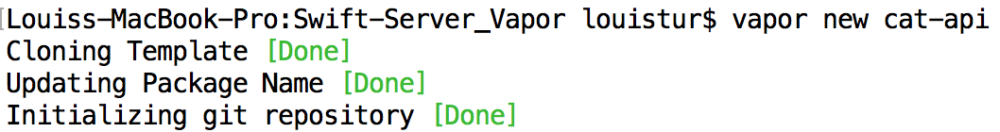
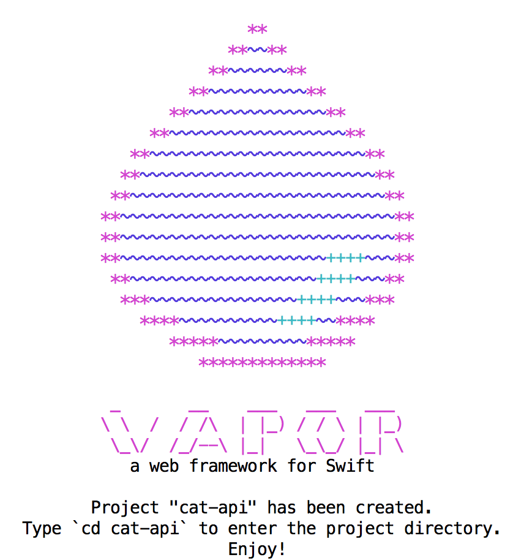

This will create a new project in your current directory. Out of the box, the vapor template is just a Swift module template with libraries specifically used by Vapor (see [Folder Structure](https://vapor.github.io/documentation/guide/folder-structure.html)). To actually start working with it inside our IDE, Xcode, we need to run one more command in the root of the project:

```vapor xcode -y```

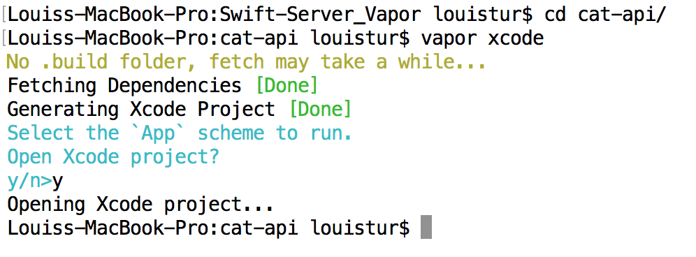

Running this command will not only create the Xcode project, but it will also build the dependancies needed for our project (more on this later). This stage will take a little bit of time to perform as Vapor will be fetching dependancies. The `-y` parameter will have Vapor automatically open the xcode project after building it. 

With XCode open, switch your schema to use the executable *App* schema (denoted by a little terminal window icon) on *My Mac* and **Build** the project. 

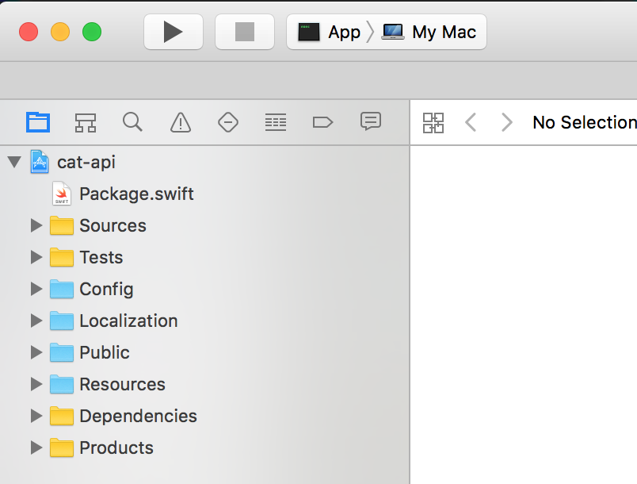

You should now be able to **Run** the project. Doing so will launch a local server on your Mac. To verify, go to 

```localhost:8080```

You should see a simple message from Vapor. 

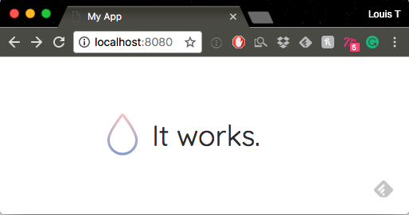

And that's it for getting up your environment started!

--
## Making Requests

We're going to be writing our code in the `Sources/App/main.swift` file. Delete the boilerplate code besides

```swift
	import Vapor
	import HTTP // you'll have to add this import 

	let drop = Droplet()

	drop.run()
```

The `Droplet` object is the singleton that will be managing all of your Vapor actions. 

### Routes

You may have touched upon, or heard of, routes in your studies. In Swift, there is a design pattern that uses Routes to transition between view controllers. From my understanding, this comes from web architecture where `routes` describe the various paths you could take when navigating a website. For example, on `github.com` you would have a route that corresponds to each registered user's account: 

```
github.com/spacedrabbit
github.com/martyav
github.com/seymotom
// `github.com` is the base url any any other page is some route from there. 
```

### You just don't `GET` me!

Ok let's say we're making an amazing CatAPI for logging when we see cats. We'll want this API to return lists of cats that we've seen and we should be able to log new cat sightings. 

We have to start somewhere, so let's start with a basic `GET` to make sure that we can communicate with the site. So just after we instatiate the `Droplet`, add in:

```swift
// creates a /cats route
drop.get("cats") { (request: Request) in
  
}
```

Calling `get` on `drop` creates a new `GET` route for our API and names it `/cats`. We can't compile/run just yet because the closure needs one of three things:

1. It needs to `throw`
2. It needs to return something (a `Node` for example)
3. It needs to return a response (something conforming to `ResponseRepresentable`)

so let's continue with:

```swift
// creates a /cats route
drop.get("cats") { (request: Request) in
  return "We've got all the cats"
}
```

Now if we run and go to `locahost:8080/cats` we can verify that we can see our text!

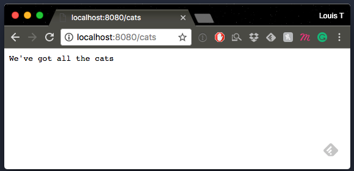

More common than returning a string from an API is returning some `JSON`. Vapor has a built in class, `JSON`, that essentially acts as a wrapper on dictionaries (it's very similar to the `JSON` de/serialization we've done). So instead of returning a single string, let's return a `JSON` response:

```swift
// creates a /cats route
drop.get("cats") { (request: Request) in
  // return "We've got all the cats"
  return try JSON(node: ["all": ["Mittens", "Socks", "Garfield"]])
}
```

We mark the return with `try` because the conversion to `JSON` can throw (just like in our practice of serialization). This is pretty neat on its own, but it becomes more salient what is happening if we run the request through Postman. Go ahead and try that now. 

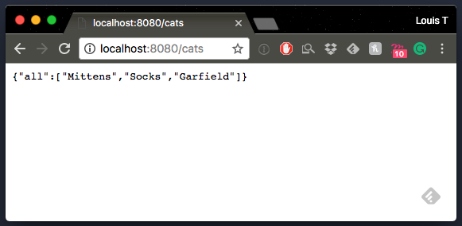

### Looking for Specific Cats (Parameterization)

Let's say we had a multitude of cats, just like we have a multitude of users. How would we specify the route needed for each one of them? Well, let's agree that our cats are registered numerically and that we can access their particular instance by going to `/cats/{id}` where `id` is an `Int` value corresponding to their `id`.

It possible to do something like 

```swift
// creates /cats/1
drop.get("cats", "1") { (request: Request) in
  return "The cat id is \(1)"
}

// creates /cats/2
drop.get("cats", "2") { (request: Request) in
  return "The cat id is \(2)"
}
```

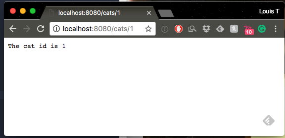

But that would take up too much time to do for each cat. So instead, we create a parameterized method call: 

```swift
drop.get("cats", ":id") { (request: Request) in
  guard let catId = request.parameters["id"]?.int else {
    throw Abort.notFound
  }
  
  return "The cat id is \(catId)"
}
```

There are a number of properties on the `request` object that can be checked for different bits of information that correspond to parameters/queries/headers/etc we'd pass in code when constructing our Swift `URL` object. In this case, we're constructing something that will look like `localhost:8080/cats/<int>`. We check the `parameters` property of `request` and look for a `key` of `id`, which corresponds to the second string parameter we passed in the `get` call. 

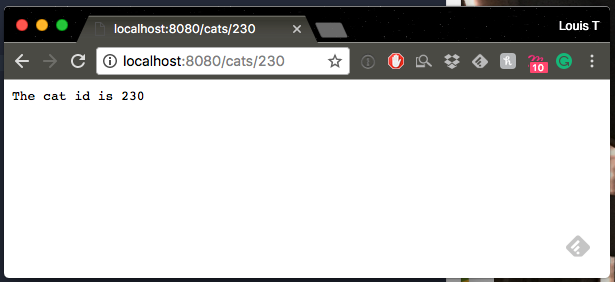

Vapor gives us another option to ensure type safety: 

```swift
// in this version, you specify the parameter type and include a var for it in the closure
drop.get("cats", Int.self) { (request: Request, id: Int) in 
	return "The cat id is \(id)"
}
```

This also gives us the opportunity to look at the errors we can throw. There are a large number of built-in errors that can be utilized to indicate that a problem has occured, and Vapor allows for you to create your own custom ones as well. 

```swift
drop.get("cats-error") { (request: Request) in
  throw Abort.custom(status: .internalServerError, message: "Cats are tangled up in the computer cables.\nTry again later")
}
```


### Models

If you're thinking that we'll probably need to define a model for our theoretical `Cats` object... well, I guess I taught you well :D

In order to build up to, and understand the `Model` protocol, we need to begin with the `NodeRepresentable`, `JSONRepresentable` and `ResponseRepresentable` protocols

#### `NodeRepresentable`

This protocol needs two methods: 

```swift
func makeNode(context: Context) throws -> Node
func makeNode() throws -> Node
```

What is a `Node`? Glad you asked: 

> Node is meant to be a transitive data structure that can be used to facilitate conversions between different types. 

It's an object that we can convert between `Bool`, `Int`, `String`, `Array`, etc. easily if needed/possible. Let's try conforming to this protocol. 

1. Create a new Swift file, named `Cats`
2. Selected the app's executable target for the file
3. Place it in the `/Sources/App/Models` folder
4. Import `Vapor` and `HTTP`

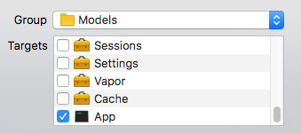

We'll give the `Cat` class three properties: `name`, `breed`, and `preferredSnack`. Creating the `Node` is straightforward since it is overloaded to accept dictionary literals:

```swift 
import Foundation
import Vapor
import HTTP

class Cat: NodeRepresentable {
  var name: String!
  var breed: String!
  var preferredSnack: String!
  
  init(name: String, breed: String, preferredSnack: String) {
    self.name = name
    self.breed = breed
    self.preferredSnack = preferredSnack
  }
  
  func makeNode() throws -> Node {
    return try Node(node: ["name": self.name,
                           "breed": self.breed,
                           "preferredSnack": self.preferredSnack])
  }
  
  func makeNode(context: Context) throws -> Node {
    return try makeNode()
  }
}
```

> Ignore the `Context` parameter for now. It's there to allow easy extensibility for other modules

And back in our `main.swift` file, add in:

```swift
drop.get("cats", "mittens") { request in
  return try JSON(node: Cat(name: "Mittens", breed: "American Shorthair", preferredSnack: "Chicken"))
}
```

Now run and check `localhost:8080/cats/mittens`. 

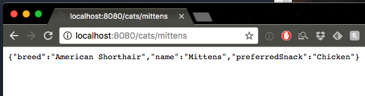

The reason we need to wrap up the Cat object in a JSON initialization is that the close expects to return an object of type `ResponseRepresentable`, which `JSON` conforms to but `NodeRepresentable` does not. 

#### `JSONRepresentable`

Fortunately, we can get `JSONRepresentable` for free as long as we conform to `NodeConvertible` as well (an extension gives a default implementation for cases were `Self: NodeRepresentable`). What does that mean for us? A tiny bit less code: 

```swift
drop.get("cats", "mittens") { request in
  return try Cat(name: "Mittens", breed: "American Shorthair", preferredSnack: "Chicken").makeJSON()
}
```

#### `ResponseRepresentable`

OK we're almost there!


Got a sense for naming conventions in the Vapor library by now? You should, it's all about how data can be represented that ensure the kind of guarantees we need. Each `xxxxxRepresentable` ensures that the object can behave in ways that the library expects. In this case, `ResponseRepresentable` ensures that we can have a `Response` object, which is directly analogous to an `HTTP` response we'd get in Postman or an `HTTPURLResponse` object in Swift. 

Here's the best part though: something that is `JSONRepresentable` has a `.makeResponse()` function that returns a `Response`! So for our class, after saying we conform to `ResponseRepresentable`, we just need to one necessary function to `Cat.swift`:

```swift
  func makeResponse() throws -> Response {
    return try self.makeJSON().makeResponse()
  }
 ```

And for our code we can simply say: 

```swift
drop.get("cats", "mittens") { request in
  return Cat(name: "Mittens", breed: "American Shorthair", preferredSnack: "Chicken")
}
```

Neat!

---

### `POST` Requests

Great, we know how to request data back from our API, but we'll likely need to `POST` some up as well. For now, we're just going to make it work and in the future we'll take a look at persistant storage. 

#### Request info

You can inspect the `Request` object for query params, header info, body info etc.. the way this is tested is via Postman (just be sure to set breakpoints ahead of time before you build/run). In our case, we're going to pass in some values via a `Request`'s `httpBody` and check for their existance in our `Droplet` closure. 

Setting up a `POST` endpoint is similar to `GET` and we can test the results via Postman: 

```swift
drop.post("cats") { (request: Request) in
  return "You're posting cats"
}
```

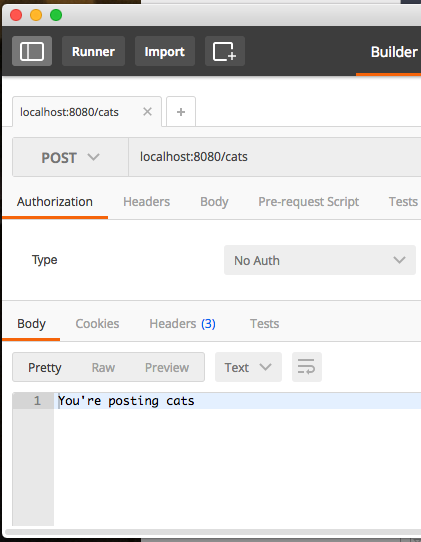

Now that making the request works, let's start unpacking data by first checking to see if in the `JSON` body that was passed in the request has a key named `name`:

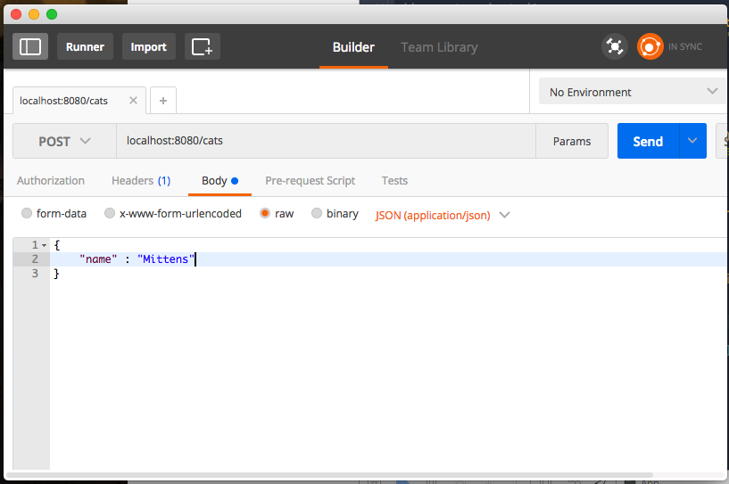

```swift
drop.post("cats") { (request: Request) in
  
  guard let catName = request.json?["name"]?.string else {
    throw Abort.badRequest
  }

  return "Cat name was: \(catName)"
}
```

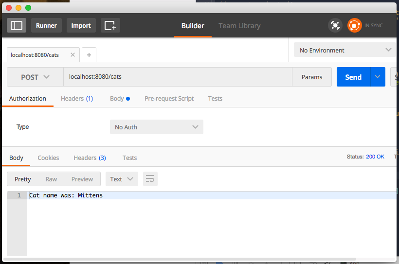

Assuming we want to create a fully-fledged `Cat` that meets our model's needs, let's pass more key-value pairs in the body and look for them: 

```swift
drop.post("cats") { (request: Request) in
  
  guard let catName = request.json?["name"]?.string,
        let catBreed = request.json?["breed"]?.string,
        let snack = request.json?["preferredSnack"]?.string
  else {
    throw Abort.badRequest
  }
  
  let newCat = Cat(name: catName, breed: catBreed, preferredSnack: snack)
  let responseCat = try newCat.makeResponse()
  
  print("Cat successfully posted: \(responseCat)")
  
  return responseCat
}
```

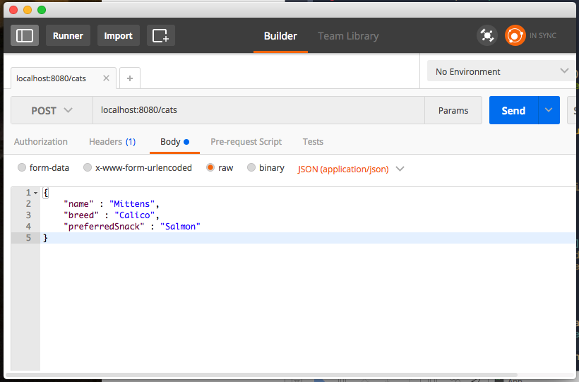
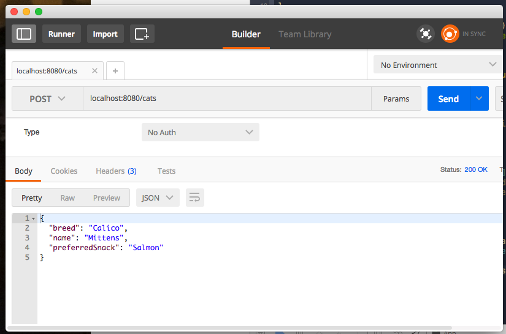


**Neat!!**

---

### Next Time:

1. Redirects
2. Groups
3. Validation
1. Leaf

### Next Next Time:

4. Dependencies
5. Database Options
2. CRUD Actions
3. Deploying
